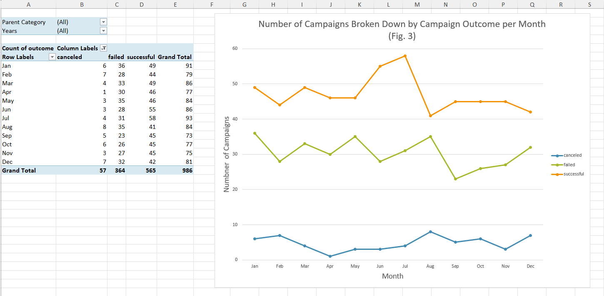

<h1> Crowdfunding Analysis with Excel</h1>
<h3>This project analyzes data from crowdfunding campaigns around the world in order to gain insight into what makes a crowdfuning campaign successful. The major findings from the project are:</h3>
1. Crowdfunding campaigns are most prevalent in the United States
2. Theater, music, and film/video are the three most popular campaign categories, with plays, a sub-cateogry of the theater category, representing almost 35% of all campaigns.
3. Campaigns started In June and July are the most likely to succeed, while campaigns started in August are the least likely to succeed.

**Raw Data**
 

**Statistical analysis of the number of backers for successful and failed campaigns**
  
 

**Number of Campaigns Broken Down by Campaign Outcome per Month**
  
The user can filter data by 'Parent Category' and 'Years' by using the dropdown menus at the top of the pivot table on the left.
 

**Number of Campaigns Broken Down by Campaign Status (successful, live, failed, or cancelled) per Campaign Sub-category**
  
The user can filter data by 'Country' and 'Parent Category' by using the dropdown menus at the top of the pivot table on the left.
 

**Number of Campaigns Broken Down by Campaign Status (successful, live, failed, or cancelled) per Campaign Category**

The user can filter data by 'Country' by using the dropdown menu at the top of the pivot table on the left.
 

**Likelyhood of Outcome per Campaign Goal Range**

